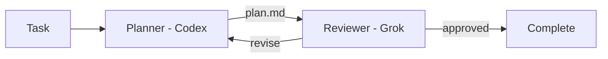

# Agentflow

**Compose AI coding agents into repeatable engineering workflows.**

Use the right model for each stage of the job.

Agentflow connects coding-agent CLIs from different providers through explicit,
repository-defined workflows. One model can plan, another can review, and the
first can revise—while Agentflow carries artifacts between them and remembers
where the process is.

Agentflow currently supports the headless `codex` and `grok` CLIs.

## Why Agentflow?

Calling two agent CLIs from a shell script is easy. Reliably coordinating them
across reviews, revisions, failures, and resumed sessions is not.

Agentflow is built around three ideas:

- **Use models for what they do best.** Assign each role to a provider and model
  suited to the work, rather than asking one agent to do everything.
- **Treat AI engineering process as code.** Keep stages, handoffs, review gates,
  and revision policies in version control beside the project they govern.
- **Keep orchestration explicit.** The team defines the process; models execute
  roles inside it. A supervisor model does not invent or dynamically control
  the workflow.

**Models describe execution. Roles describe intent.** Changing the model behind
a role does not require rewriting the workflow.

**Common workflow model, native provider capabilities.** Agentflow coordinates
the process, while each provider CLI remains responsible for authentication,
agent execution, and its own tools and options.



## Quickstart

Requirements: Python 3.11+, [uv](https://docs.astral.sh/uv/), and authenticated
provider CLIs named by your configuration.

Install Agentflow in your project (bash or zsh):

```bash
uv add git+ssh://git@github.com/nodeint/agentflow.git@eb7ed1c6be9f91e8b9f8cdafbb9d9f9da8bb89ea#subdirectory=packages/{kernel,adapters,cli}
```

Verify with `uv run agentflow --help`.

The examples below use `agentflow` for readability. With uv, prefix commands
with `uv run`.

In the project where agents will work, create two files:

```text
.agentflow/
├── config.yaml
└── workflows/
    └── plan.yaml
```

`.agentflow/config.yaml` assigns provider models to roles:

```yaml
models:
  planner-model:
    provider: codex
    model: gpt-5
    options:
      thinking: medium

  reviewer-model:
    provider: grok
    model: grok-4
    options:
      thinking: high

roles:
  planner:
    default_model: planner-model
  reviewer:
    default_model: reviewer-model
```

Use model identifiers supported by your installed provider CLIs.

`.agentflow/workflows/plan.yaml` defines the process:

```yaml
id: plan
constraints:
  - Do not write implementation code.

stages:
  - id: plan
    role: planner
    depends_on: []
    max_revisions: 3
    instructions:
      - Analyze the task and write an implementation plan.
    produces:
      artifact: plan.md

  - id: review-plan
    role: reviewer
    depends_on: [plan]
    instructions:
      - Review the plan for correctness, missing risks, and unnecessary scope.
    decision:
      values: [approved, revise]
      routes:
        approved: complete
        revise: plan

completion:
  stage: review-plan
  decision: approved
  outputs:
    - name: plan
      from_stage: plan
      artifact: plan.md
```

Run the workflow from that project or any of its subdirectories:

```bash
agentflow start plan --task "Plan the account settings redesign"
```

Agentflow runs the next eligible stage until the workflow completes or stops.
Progress goes to stderr; stdout contains one JSON result with the session ID,
status, stop reason, stage results, and published outputs.

```json
{
  "session_id": "<session-id>",
  "session_status": "completed",
  "stop_reason": "completed",
  "outputs": {
    "plan": {}
  },
  "stages": {}
}
```

Inspect or resume the recorded session:

```bash
agentflow sessions
agentflow watch <session-id>
agentflow continue <session-id>
```

Commit `.agentflow/config.yaml` and `.agentflow/workflows/`. Keep
`.agentflow/sessions/` out of version control; it contains machine-local
execution state and generated artifacts.

## Concepts

A workflow connects stages through dependencies and explicit decision routes.

- A **model** identifies a provider model and its execution options.
- A **role** names a kind of work and selects its default model.
- A **stage** assigns work to a role and may declare dependencies, an artifact,
  a decision, or both.
- An **artifact** is a named file produced by a successful stage and stored with
  the workflow session.
- A **decision** selects the next route, including a route back for revision.
- A **session** records executions, events, decisions, and artifacts so work can
  be inspected or resumed.

Use `depends_on` to give a stage upstream artifacts. Use `session.resume_from`
when the stage must also continue a provider's prior conversational session.

## Current scope

Agentflow is a local, file-backed orchestration layer for provider CLIs. It does
not replace their agent runtimes, and it does not hide their distinctive
capabilities behind a lowest-common-denominator API.

Today, Agentflow supports Codex and Grok, explicit stage routing, review loops,
local session history, provider-session resume, prerequisite workflows, and
standalone role execution.

## Documentation

- [Writing workflows](docs/workflows.md)
- [Providers and model configuration](docs/providers.md)
- [Sessions and workflow composition](docs/sessions.md)
- [CLI commands and execution controls](docs/cli.md)

Run `agentflow <command> --help` for the exact command contract, output fields,
and exit codes.

## Development

The workspace contains `agentflow-kernel`, `agentflow-adapters`, and
`agentflow-cli`. See [CONTRIBUTION.md](CONTRIBUTION.md) for repository layout,
test conventions, and development commands.

## License

Agentflow is licensed under the [MIT License](LICENSE).
