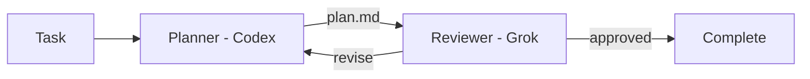

# Agentflow

**Compose AI coding agents into repeatable engineering workflows.**

Use the right model for each stage of the job.

Agentflow connects coding-agent CLIs from different providers through explicit,
repository-defined workflows. One model can plan, another can review, and the
first can revise—while Agentflow carries artifacts between them and remembers
where the process is.

Agentflow currently supports the headless `codex` and `grok` CLIs.

## Contents

- [Why Agentflow?](#why-agentflow)
- [Quickstart](#quickstart)
  - [Install](#install)
  - [Upgrade](#upgrade)
  - [Create a project](#create-a-project)
  - [Run](#run)
- [Concepts](#concepts)
- [Current scope](#current-scope)
- [Documentation](#documentation)
- [Development](#development)
- [License](#license)

## Why Agentflow?

Calling two agent CLIs from a shell script is easy. Reliably coordinating them
across reviews, revisions, failures, and resumed sessions is not.

Agentflow is built around three ideas:

- **Use models for what they do best.** Assign each role to a provider and model
  suited to the work, rather than asking one agent to do everything.
- **Treat AI engineering process as code.** Keep stages, handoffs, review gates,
  and revision policies in version control beside the project they govern.
- **Keep orchestration explicit.** The team defines the process; models execute
  roles inside it. A supervisor model does not invent or dynamically control
  the workflow.

**Models describe execution. Roles describe intent.** Changing the model behind
a role does not require rewriting the workflow.

**Common workflow model, native provider capabilities.** Agentflow coordinates
the process, while each provider CLI remains responsible for authentication,
agent execution, and its own tools and options.


```mermaid
flowchart LR
    A[Task] --> B[Planner - Codex]
    B -->|plan.md| C[Reviewer - Grok]
    C -->|revise| B
    C -->|approved| D[Complete]
```

## Quickstart

Python 3.11+, [uv](https://docs.astral.sh/uv/), and authenticated provider CLIs
named by your configuration.

### Install

From any directory:

```bash
uv tool install --with 'git+ssh://git@github.com/nodeint/agentflow.git#subdirectory=packages/kernel' --with 'git+ssh://git@github.com/nodeint/agentflow.git#subdirectory=packages/adapters' --with 'git+ssh://git@github.com/nodeint/agentflow.git#subdirectory=packages/registry' 'git+ssh://git@github.com/nodeint/agentflow.git#subdirectory=packages/cli'
```

Verify with `agentflow --help`.

### Upgrade

Upgrade an existing install to the latest commit on the default branch:

```bash
uv tool upgrade agentflow-cli
```

That refreshes the packages recorded at install time. When the install command
gains or drops a package, run the `uv tool install` command above again.

### Create a project

From the project where agents will work:

```bash
agentflow init --preset plan
```

`init` writes the config, a plan-and-review workflow, and a gitignore for local
session state:

```text
.agentflow/
├── config.yaml
├── .gitignore
└── workflows/
    └── plan.yaml
```

In a terminal, pick the provider, model, and prompted options from the lists.
Pass `--provider` and `--model` together when input is not a terminal. Commit
`config.yaml` and `workflows/`. Leave `.agentflow/sessions/` untracked.

Model and role shape is in [Providers and model configuration](docs/providers.md).
A full plan workflow is in [Writing workflows](docs/workflows.md#complete-example).

### Run

From that project or any of its subdirectories:

```bash
agentflow start plan --task "Plan the account settings redesign"
```

Agentflow runs the next eligible stage until the workflow completes or stops.
Progress goes to stderr. Stdout is one JSON result.

```bash
agentflow sessions
agentflow watch <session-id>
agentflow continue <session-id>
```

Command fields and exit codes are in
[CLI commands and execution controls](docs/cli.md). Session files are in
[Sessions and workflow composition](docs/sessions.md).

## Concepts

A workflow connects stages through dependencies and explicit decision routes.

- A **model** identifies a provider model and its execution options.
- A **role** names a kind of work and selects its default model.
- A **stage** assigns work to a role and may declare dependencies, an artifact,
  a decision, or both.
- An **artifact** is a named file produced by a successful stage and stored with
  the workflow session.
- A **decision** selects the next route, including a route back for revision.
- A **session** records executions, events, decisions, and artifacts so work can
  be inspected or resumed.

Use `depends_on` to give a stage upstream artifacts. Use `session.resume_from`
when the stage must also continue a provider's prior conversational session.

## Current scope

Agentflow is a local, file-backed orchestration layer for provider CLIs. It does
not replace their agent runtimes, and it does not hide their distinctive
capabilities behind a lowest-common-denominator API.

Today, Agentflow supports Codex and Grok, explicit stage routing, review loops,
local session history, provider-session resume, prerequisite workflows, and
standalone role execution. A machine-local registry service records workspaces
so another tool can ask which projects exist.

## Documentation

- [Writing workflows](docs/workflows.md)
- [Providers and model configuration](docs/providers.md)
- [Sessions and workflow composition](docs/sessions.md)
- [CLI commands and execution controls](docs/cli.md)

Run `agentflow <command> --help` for the exact command contract, output fields,
and exit codes.

## Development

The workspace contains `agentflow-kernel`, `agentflow-adapters`,
`agentflow-registry`, and `agentflow-cli`. See [CONTRIBUTION.md](CONTRIBUTION.md) for repository layout,
test conventions, and development commands.

## License

Agentflow is licensed under the [MIT License](LICENSE).
